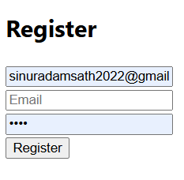
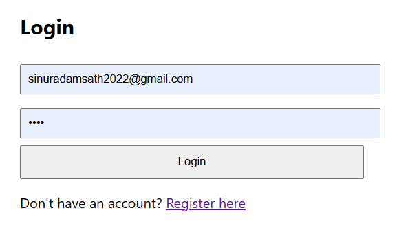

# 💬 Messaging App

A full-stack real-time messaging web application built with **React**, **Node.js**, **Express**, **MongoDB**, and **Socket.IO**.

## 🚀 Features

- 🔐 User Registration & Login (Authentication)
- 🧑‍🤝‍🧑 Create or Join Chats
- 💬 Real-time Messaging
- ✏️ Edit & Delete Messages
- 🚪 Join / Leave Chat Rooms
- 📡 Live Updates via WebSockets (Socket.IO)

## 🛠️ Tech Stack

### Frontend
- React
- React Router
- Axios

### Backend
- Node.js
- Express.js
- MongoDB (Mongoose)
- Socket.IO
- bcrypt
- JWT (JSON Web Tokens)

## 📁 Project Structure
messaging-app/
├── backend/
│ ├── models/
│ ├── routes/
│ ├── controllers/
│ ├── config/
│ └── server.js
├── frontend/
│ ├── src/
│ │ ├── components/
│ │ ├── App.js
│ │ └── index.js


## ⚙️ Installation

### 1. Clone the repository
```bash
git clone https://github.com/SinuDam/messaging-app.git
cd messaging-app

2. Install dependencies
Backend:
cd backend
npm install

Frontend:
cd ../frontend
npm install

3. Environment Variables
Create a .env file inside the backend/ folder:
MONGO_URI=your_mongodb_connection_string
PORT=5000
JWT_SECRET=your_secret_key

4. Run the app
Backend:
npm start

Frontend:
npm start

## 📸 Screenshots

### Register Page


### Login Page


📄 License
MIT License © 2025 Sinura Damsath Perera


